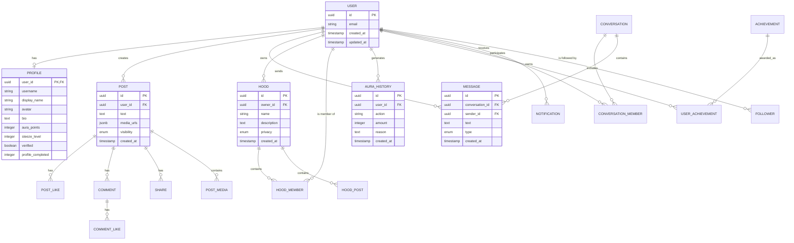

# ORA Domain Model

## Overview

This document defines the core domain models for ORA, their relationships,
lifecycle, and future considerations.

---

## User

### Purpose
Represents an authenticated user in the system.

### Main Fields
- `id` — UUID, primary key
- `email` — string, unique, used for authentication
- `created_at` — timestamp
- `updated_at` — timestamp

### Relationships
- Has one `Profile`
- Has many `Posts`
- Has many `Messages` (as sender)
- Has many `ConversationMembers`
- Has many `HoodMembers`
- Has many `AuraHistory`
- Has many `UserAchievements`
- Has many `Followers` (as follower)
- Has many `Followees` (as following)

### Lifecycle
1. Created during registration via `/auth/register`.
2. Updated on profile changes.
3. Soft-deleted on account deletion.

### Future Considerations
- Email verification status
- Account suspension/bans
- Last login timestamp
- Device tokens for push notifications

---

## Profile

### Purpose
Stores public and personal information about a user.

### Main Fields
- `user_id` — UUID, foreign key to `users`
- `username` — string, unique
- `display_name` — string
- `avatar` — string (URL or path)
- `bio` — text
- `school` — string
- `city` — string
- `country` — string
- `website` — string
- `interests` — array of strings
- `aura_points` — integer, default 0
- `steeze_level` — integer, default 1
- `verified` — boolean, default false
- `profile_completed` — integer (percentage), default 0

### Relationships
- Belongs to `User`

### Lifecycle
1. Created on user registration.
2. Updated when user edits profile.
3. `profile_completed` recalculated on every update.

### Future Considerations
- Privacy settings per field
- Profile themes
- Badges display

---

## Post

### Purpose
Represents a user-generated post in the feed.

### Main Fields
- `id` — UUID, primary key
- `user_id` — UUID, foreign key to `users`
- `text` — text
- `media_urls` — array of strings
- `visibility` — enum (public, friends, private)
- `created_at` — timestamp
- `updated_at` — timestamp

### Relationships
- Belongs to `User`
- Has many `PostLikes`
- Has many `Comments`
- Has many `Shares`

### Lifecycle
1. Created by user.
2. Updated on edit (within a time window).
3. Deleted by owner or moderator.

### Future Considerations
- Post categories/tags
- Scheduled posts
- Drafts

---

## PostMedia

### Purpose
Stores media attachments for posts.

### Main Fields
- `id` — UUID, primary key
- `post_id` — UUID, foreign key to `posts`
- `url` — string
- `type` — enum (image, video)
- `order` — integer

### Relationships
- Belongs to `Post`

---

## Comment

### Purpose
Represents a comment on a post.

### Main Fields
- `id` — UUID, primary key
- `post_id` — UUID, foreign key to `posts`
- `user_id` — UUID, foreign key to `users`
- `text` — text
- `created_at` — timestamp
- `updated_at` — timestamp

### Relationships
- Belongs to `Post`
- Belongs to `User`
- Has many `CommentLikes`

---

## CommentLike

### Purpose
Tracks likes on comments.

### Main Fields
- `comment_id` — UUID, foreign key to `comments`
- `user_id` — UUID, foreign key to `users`
- `created_at` — timestamp

### Relationships
- Belongs to `Comment`
- Belongs to `User`

---

## PostLike

### Purpose
Tracks likes on posts.

### Main Fields
- `post_id` — UUID, foreign key to `posts`
- `user_id` — UUID, foreign key to `users`
- `created_at` — timestamp

### Relationships
- Belongs to `Post`
- Belongs to `User`

---

## Share

### Purpose
Tracks post shares.

### Main Fields
- `post_id` — UUID, foreign key to `posts`
- `user_id` — UUID, foreign key to `users`
- `created_at` — timestamp

### Relationships
- Belongs to `Post`
- Belongs to `User`

---

## Follower

### Purpose
Tracks user follow relationships.

### Main Fields
- `follower_id` — UUID, foreign key to `users`
- `following_id` — UUID, foreign key to `users`
- `created_at` — timestamp

### Relationships
- Belongs to `User` (follower)
- Belongs to `User` (following)

---

## Hood

### Purpose
Represents a community/group in ORA.

### Main Fields
- `id` — UUID, primary key
- `owner_id` — UUID, foreign key to `users`
- `name` — string
- `description` — text
- `category` — string
- `banner` — string (URL)
- `privacy` — enum (public, private)
- `created_at` — timestamp
- `updated_at` — timestamp

### Relationships
- Belongs to `User` (owner)
- Has many `HoodMembers`
- Has many `HoodPosts`

### Lifecycle
1. Created by a user.
2. Updated by owner or moderators.
3. Deleted by owner.

### Future Considerations
- Moderators list
- Hood rules
- Invite links

---

## HoodMember

### Purpose
Tracks membership in Hoods.

### Main Fields
- `hood_id` — UUID, foreign key to `hoods`
- `user_id` — UUID, foreign key to `users`
- `role` — enum (member, moderator, owner)
- `joined_at` — timestamp

### Relationships
- Belongs to `Hood`
- Belongs to `User`

---

## HoodPost

### Purpose
Represents a post within a Hood.

### Main Fields
- `id` — UUID, primary key
- `hood_id` — UUID, foreign key to `hoods`
- `user_id` — UUID, foreign key to `users`
- `text` — text
- `media_urls` — array of strings
- `created_at` — timestamp

### Relationships
- Belongs to `Hood`
- Belongs to `User`

---

## Conversation

### Purpose
Represents a direct message conversation.

### Main Fields
- `id` — UUID, primary key
- `created_at` — timestamp
- `updated_at` — timestamp

### Relationships
- Has many `ConversationMembers`
- Has many `Messages`

---

## ConversationMember

### Purpose
Tracks participants in a conversation.

### Main Fields
- `conversation_id` — UUID, foreign key to `conversations`
- `user_id` — UUID, foreign key to `users`
- `joined_at` — timestamp

### Relationships
- Belongs to `Conversation`
- Belongs to `User`

---

## Message

### Purpose
Represents a message in a conversation.

### Main Fields
- `id` — UUID, primary key
- `conversation_id` — UUID, foreign key to `conversations`
- `sender_id` — UUID, foreign key to `users`
- `text` — text
- `media_url` — string (optional)
- `type` — enum (text, image, voice)
- `reply_to` — UUID (optional, self-referential)
- `read_by` — array of user IDs
- `created_at` — timestamp

### Relationships
- Belongs to `Conversation`
- Belongs to `User` (sender)

### Future Considerations
- Message reactions
- Edit/delete tracking

---

## Notification

### Purpose
Represents a notification for a user.

### Main Fields
- `id` — UUID, primary key
- `user_id` — UUID, foreign key to `users`
- `type` — enum (like, comment, follow, mention, hood_invite, achievement)
- `reference_id` — UUID (optional, references related entity)
- `reference_type` — string (optional, e.g., "post", "comment")
- `read` — boolean, default false
- `created_at` — timestamp

### Relationships
- Belongs to `User`

---

## Achievement

### Purpose
Defines an achievement that users can unlock.

### Main Fields
- `id` — UUID, primary key
- `code` — string, unique (e.g., "first_impression")
- `name` — string
- `description` — text
- `icon` — string
- `aura_reward` — integer
- `criteria` — JSON (conditions to unlock)

### Relationships
- Has many `UserAchievements`

---

## UserAchievement

### Purpose
Tracks achievements unlocked by users.

### Main Fields
- `user_id` — UUID, foreign key to `users`
- `achievement_id` — UUID, foreign key to `achievements`
- `unlocked_at` — timestamp

### Relationships
- Belongs to `User`
- Belongs to `Achievement`

---

## AuraHistory

### Purpose
Records every change to a user's Aura points.

### Main Fields
- `id` — UUID, primary key
- `user_id` — UUID, foreign key to `users`
- `action` — string (e.g., "achievement", "post_like", "daily_login")
- `amount` — integer (positive or negative)
- `reason` — text
- `created_at` — timestamp

### Relationships
- Belongs to `User`

### Lifecycle
1. Created on every Aura change.
2. Never updated or deleted.
3. Used for audit trail and leaderboard calculations.

---

## LeaderboardEntry

### Purpose
Cached leaderboard data for performance.

### Main Fields
- `user_id` — UUID, foreign key to `users`
- `rank` — integer
- `period` — enum (daily, weekly, monthly, all_time)
- `aura` — integer
- `cached_at` — timestamp

### Relationships
- Belongs to `User`

### Future Considerations
- Precomputed rankings refreshed on a schedule
- Regional leaderboards

---

## Entity Relationship Diagram

